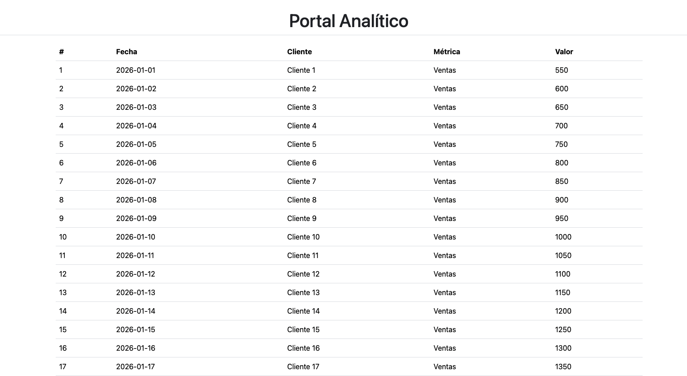

# Prueba Técnica – Consultor Analítico

## Descripción
Proyecto Django básico que demuestra fundamentos del framework, pensamiento analítico mediante SQL y criterio profesional.



## Requisitos
- Python 3.10+
- Django 5+

## Instalación y ejecución
```bash
# Clonar el repositorio
git clone https://github.com/urian121/analytics_portal.git

# Entrar en el directorio del proyecto
cd analytics_portal

# Crear entorno virtual
python -m venv venv

# Activar entorno virtual en Windows
source env/Script/activate

# Activar entorno virtual en Mac
source env/bin/activate

# Instalar dependencias del proyecto
pip install -r requirements.txt 

# Ejecutar el servidor de desarrollo
python manage.py runserver 

# Acceder a la aplicación desde el navegador visitando:
http://localhost:8000/dashboard/
```

## Bloque 1 – Fundamentos Django

Se creó un proyecto Django con una app `dashboard` que renderiza una vista HTML (`home.html`) con datos simulados desde el backend.
No se utiliza base de datos ni persistencia, cumpliendo con el alcance solicitado.

## Bloque 2 – Pensamiento Analítico y SQL

### Consumo de datos en Django

La lógica de acceso a datos se separó en un módulo de servicios encargado de la conexión y ejecución de queries en BigQuery.
Las vistas consumen estos servicios y envían los datos ya procesados al template, manteniendo el frontend desacoplado de la fuente de datos.

### Queries SQL

Los queries utilizados se encuentran en `./sql/queries.sql`.

## Decisiones técnicas

* Separación de responsabilidades entre vistas y servicios.
* Datos simulados para evitar dependencias innecesarias.
* Código simple y legible alineado con el alcance de la prueba.

## Principales aprendizajes

* Organización de un proyecto Django básico.
* Aplicación de SQL analítico para consultas de negocio.
* Importancia de comunicar decisiones técnicas de forma clara.

### Respuesta del Bloque 3 – Criterio Profesional

1. ¿Cómo abordarías un requerimiento técnicamente incorrecto solicitado por un cliente?

Primero analizaría el requerimiento para entender el objetivo real del cliente.
Propondría una alternativa viable que cumpla el objetivo del negocio sin comprometer la estabilidad o escalabilidad del sistema.

La idea es guiar al cliente desde la necesidad hacia una solución correcta, no solo rechazar el requerimiento.

1. ¿Qué harías si debes trabajar con una tecnología que no dominas y el proyecto ya inició?

Identificaría las partes críticas del proyecto y aprendería lo necesario apoyándome en la documentación oficial.
De ser posible, solicitaría apoyo puntual para avanzar sin afectar los tiempos del proyecto.

3. ¿Cómo aseguras calidad técnica cuando trabajas bajo presión de tiempo?

Priorizo los requerimientos críticos y mantengo soluciones simples y legibles.
Aplico buenas prácticas básicas y dejo identificadas mejoras para iteraciones futuras si el tiempo es limitado.
